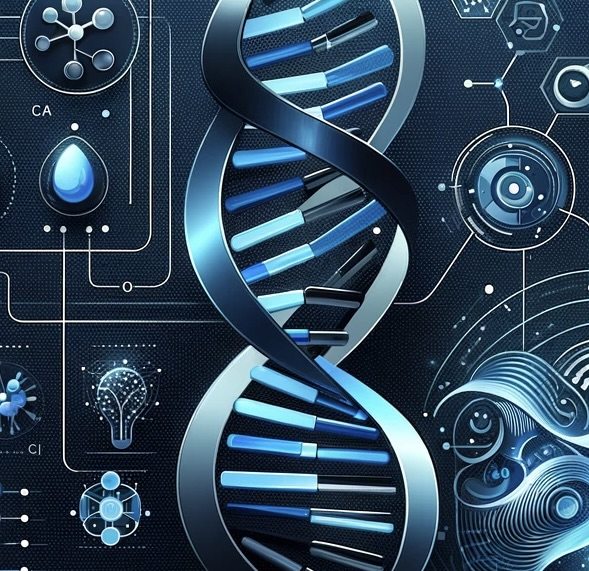

# Data Analyst

#### Technical Skills: Python, SQL, Tableau, ML Algorithms, Neural Networks

## Education
- B.S., Computer Engineering| Kennesaw State University (_May 2023_)
- A.S., Electrical Engineering | Clarence Fritzroy Bryant College (_September 2018_)

## Work Experience
**Data Analyst @ LendingPoint (_June 2023_ - _January 2024_)**
- Partnered with Senior Data Analyst in Business Development to analyze 2023 Refi Performance using BigQuery and Tableau, driving strategic changes that boosted Refi Volume by $15 Million.
- Developed a DOMO-based SQL dashboard for the Vice President of Point Of Need, facilitating real-time tracking of vendor funding and applications, reducing fraudulent merchant applications by 23%
- Led the creation of a master QA datasheet using BI tools, achieving a 31% reduction in Full-Time Equivalent hours, enhancing data visibility and impact analysis for non-SQL users, including project managers and executives.

**Customer Service @ LendingPoint (_August 2021_ - _June 2023_)**
- Managed 100+ daily customer inquiries with care, empathy, and effective problem-solving, resulting in increased loyalty and a 4.9/5 customer satisfaction rating over 30,000 calls.
- Collaborated closely with team members to collectively develop and implement best practices for consistent and exceptional customer service delivery, fostering a culture of excellence.
- Adapted to feedback, implemented effective strategies, and consistently exceeded performance metrics, earning recognition as a top performer. These experiences have equipped me with valuable skills to excel in roles such as Data Analytics.

## Projects
## DNA Sequence Classification with Advanced ML Techniques
[View Results](https://github.com/Drichards124/DNA-Sequence/tree/main) (Github)

Utilized advanced machine learning techniques and neural network architectures, specifically a Multi-layer Perceptron (MLP) classifier, to decode and classify genetic sequences from a comprehensive DNA dataset. The project's goal was to map segments of DNA to their corresponding nucleotides meticulously—adenine (A), cytosine (C), guanine (G), and thymine (T)—with high accuracy and efficiency. Through rigorous preprocessing of biological data into a machine-readable format and meticulous training of the neural model, I leveraged the MLP's sophisticated pattern recognition capabilities to achieve this objective.

## Bank Customer Churn Prediction Using ANN and H2O AutoML
[View Results](https://github.com/Drichards124/bank-customer-churn-prediction.git) (Github)

Utilized Python to implement and compare two machine learning models, an Artificial Neural Network (ANN) and H2O's Automated Machine Learning (AutoML), to predict customer churn. Starting with comprehensive data analysis and feature engineering, I identified key factors contributing to customer turnover. I then constructed a tailored ANN model to detect intricate customer behaviors and an H2O AutoML ensemble model for robust prediction capabilities. I aimed to accurately classify and assign a probability to potential churn, enabling targeted and effective customer retention strategies. Through this methodical approach, I aimed to leverage the predictive power of machine learning to reduce customer churn.

## Location-Based Restaurant Recommendation System 
[View Results](https://github.com/Drichards124/location-based-recommendation-system.git) (Github)

Developed a location-based restaurant recommendation system using this [Yelp Dataset](https://www.dropbox.com/s/3x1w789mmuae3ao/yelp_academic_dataset_business.zip). Key to this was the application of KMeans clustering, focusing on user reviews and geographical data. I employed Plotly and GeoPandas to visualize the spatial data effectively, enhancing the interpretability of the model. The project culminated in creating a function that recommends restaurants based on user-provided geographic coordinates, demonstrating my skills in leveraging machine learning and data visualization tools to derive practical, user-focused solutions.

## Sentiment Analysis of YouTube Viewer Comments
[View Results](https://github.com/Drichards124/sentiment-analysis.git) (Github)

Applied sentiment analysis models to analyze viewers' comments on various YouTube videos to determine whether the overall sentiment is positive, negative, or neutral. This approach seeks to provide a detailed insight into audience reactions and engagement.

## Strategic Insights: E-commerce Sales Data Analysis 
[View Results](https://github.com/Drichards124/Sales-Data_Analysis) (Github)

Utilized sophisticated data analytics and visualization tools to thoroughly examine a diverse electronics store's 2019 sales figures, revealing key insights and trends. The primary goal was to utilize this data to inform strategic choices, highlight growth prospects, and identify crucial improvement areas. This initiative will lay the groundwork for focused business strategies and enhance market competitiveness.

